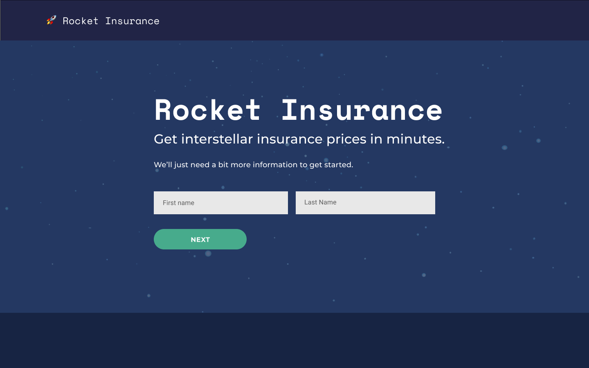
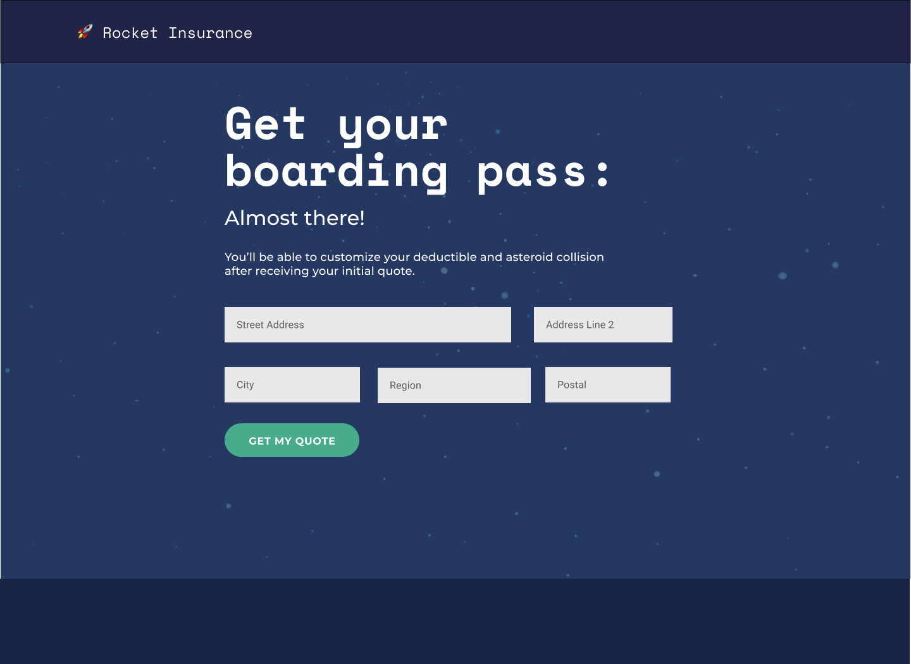
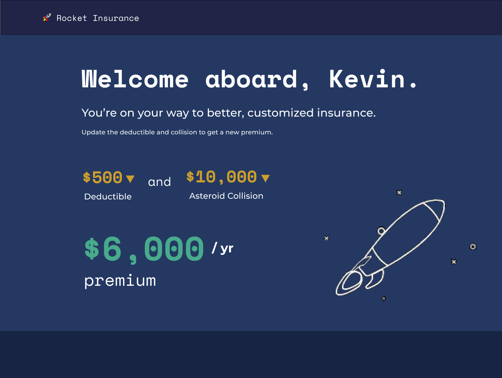

# SURE 🚀 Rocket Insurance - FED Coding Challenge 
This was about a `15hr` coding commitment primarily because I decided to add some flair and extra features to it. For reference, I worked on this project from Friday (10/2) to Tuesday(10/6).

**Live Link**: http://rocket.cunanan.dev.s3-website-us-west-2.amazonaws.com/

## Links
---
* [Install](#install)
* [Project Config](#project-config)
* [Deployment](#deployment)
* [Mockups](#mockups)
* [What Can Be Improved](#what-can-be-improved)
* [Summary](#summary)

## Install
---

    git clone https://github.com/kcunanan/Rocket-Insurance-UI.git

    npm install

    npm run start

Browser should open up on `rocket.lvh.me:3000`

*Note: You may need to click `Proceed to site` since there's no SSL certificate set up on new environments.*

## Project Config
---
The project uses the following modified from a Create React App Project
* `Typescript` (3.8)
* `React` (16.13)
* `Webpack`
* `ESLint`

The primary libraries used are:
* `@material-ui/core` - UI Library for Components, Styling, Breakpoints
* `@material-ui/icons` - Icons (really just the checkmark)
* `lottie-react-web` - Used for all SVG animations
* `react-hook-form` - Form validation and state management
* `react-particles-js` - For the cool particle effect background on the Ratings Page
* `react-router-dom` - Simple routing between ratings and quote
* `react-transition-group` - Helps with transitions for Ratings page

## Deployment
---
This project deploys automatically to [this S3 bucket endpoint](http://rocket.cunanan.dev.s3-website-us-west-2.amazonaws.com/) on successful pushes to `master`. You can [check recent actions here](https://github.com/kcunanan/Rocket-Insurance-UI/actions).

## Mockups
---
I typically feel that I build UI pages better if I have a strong concept of what the page should look like. Using `Figma` [I built out pages](https://www.figma.com/file/HR6byETUe6g6zHdFsFOqwc/SURE-Insurance-FE-Project?node-id=5%3A382) including a Ratings (Name), Ratings (Address), and Quote.

### Color Scheme
Color scheme was based off a satellite image with an interesting color scheme. I felt the palette was vibrant, but had a cool purple color for the primary accent. Purple can convey [mystery](https://www.toptal.com/designers/ux/color-in-ux) and is fitting for some space exploration.

    
    
Satellite Image

     
    
    
Color Scheme from <a target="_blank" href="https://www.google.com/url?sa=i&url=https%3A%2F%2Fwww.pinterest.com%2Fpin%2F418834834082168677%2F&psig=AOvVaw3QWPnyDRTgTExdFhhE3KIS&ust=1602119313672000&source=images&cd=vfe&ved=0CAIQjRxqFwoTCPiZttaloewCFQAAAAAdAAAAABAD">Satellite Image</a>

     

**Ratings (Name Form)**

    

**Ratings (Address Form)**

    

**Quote**

    

 

## What Can Be Improved
---
### Testing
Testing felt like it was out of scope for this initial assignment. Although TypeScript helped a lot in ensuring my app works well, there are a handful of tests I want to tackle [from this issue](https://github.com/kcunanan/Rocket-Insurance-UI/issues/25). Specifically the following:
* `api` - The fetch API logic could be mocked and tested **especially on errors**
* [ControlledTextInput](https://github.com/kcunanan/Rocket-Insurance-UI/blob/master/src/components/Common/ControlledTextInput.tsx) - This reusable component is used for reducing code logic on forms and inputs. However, we could test the trigger prop retrieval works and holds state as expected.
* Ratings Page - Check transitions, buttons, and submit
  * Form Validation - Add validation test cases
* Quote Page - Transition works properly
  * [Premium Component](https://github.com/kcunanan/Rocket-Insurance-UI/blob/master/src/components/Quote/Premium/Premium.tsx) - Renders properly
  * [Variable Select Component](https://github.com/kcunanan/Rocket-Insurance-UI/blob/master/src/components/Quote/VariableSelect/VariableSelect.tsx) - Renders menu and handles onChange events properly

### Error Handling
The application could also use some more error handling for what to do on bad API responses from the Fetch API.

### Mobile Responsiveness
While I added some breakpoint logic for reducing text size and grid layout, I think I could update the UI to make it more engaging for the user.

### Accessibility
Currently the forms are not super accessible for non-mouse users. More use of `tabIndex` and keyboard navigation would help take this site to the next level.

### CI
Adding tests will let me add CI to the `GitHub Actions Workflow`.

## Summary
---
The application was interesting to work on, mostly because I learned a lot about TypeScript (this is the first in depth TypeScript project). I think it showcases what I'm capable of given a few days, and knowing how to build this all will only make me work faster in future projects. I'd love to hear what feedback and improvements can be made to make insurance applications more engaging and usable.
